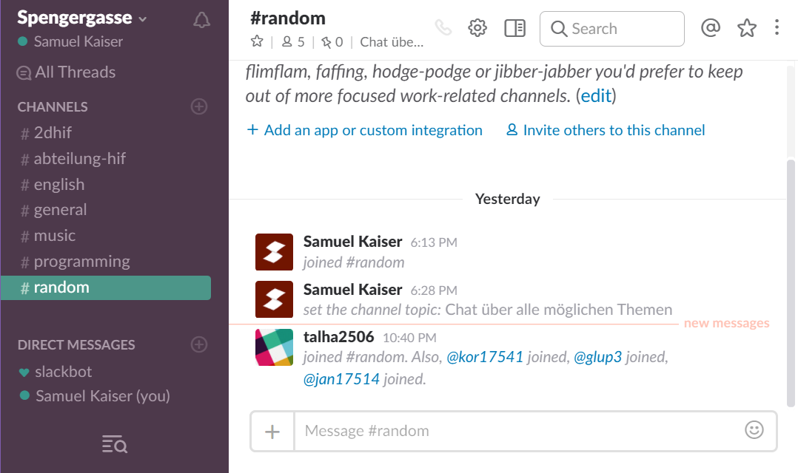
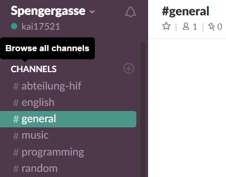
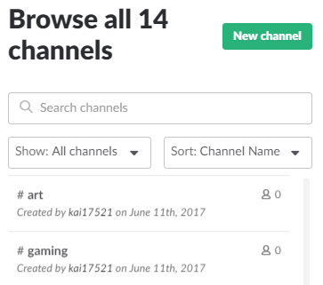

# Spengergasse Chat

Das inoffizielle Slack-Team der HTL Spengergasse dient dazu, Schülerinnen und
Schüler zu vernetzen. Dies bietet die Möglichkeit, sich mit anderen
Schüler*innen der Spengergasse über verschiedenste Themen in entsprechenden
Channels zu unterhalten, zu diskutieren, schulische und außerschulische
Aktivitäten zu planen und vieles mehr.

> Bitte nach dem Registrieren die **[Channel](#channels)-Liste durchschauen**
> und relevanten Channels beitreten.

## Inhaltsverzeichnis

1. [Registrierung](#registrierung)
2. [Channels](#channels)
3. [Zugriff](#zugriff)
4. [Regeln](#regeln)
5. [Disclaimer](#disclaimer)

## Registrierung

Alle Mitglieder der HTL Spengergasse können sich unter dem folgenden Link
registrieren:

> **[Registrieren](https://spengergasse-chat.slack.com/signup)**
> – spengergasse-chat.slack.com/signup

* Als **Email-Adresse** ist die eigene Spengergassen-Email anzugeben
  (endet mit `@spengergasse.at`).
* Für den **Username** wird der vordere Teil der eigenen Email-Adresse empfohlen,
  z.B. `xyz12345` für `xyz12345@spengergasse.at`.
* Bitte bei der Registrierung den richtigen Vor- und Nachnamen angeben, damit
  dich andere erkennen können.

Nach dem Registrieren ist zu empfehlen, das Profil einzurichten und
dementsprechend Vor- und Nachname, Profilbild und Status einzustellen.
Man ist nun automatisch im #general- und #random-Channel, wo man sich direkt
mit anderen unterhalten kann.

Slack selber sieht dann ungefähr so aus:

## Channels

Slack-Teams basieren auf Channels. Jedem Mitglied steht frei, selbst Channels zu
erstellen die öffentlich oder nur per Einladung zu betreten sind,
z.B. für einzelne Abteilungen, Klassen oder Interessengemeinschaften.

Möchte man einem Channel beitreten, klickt man auf die Überschrift "Channels"
in der Sidebar, um den Channel aus der Liste auszuwählen.

Nun kann ein beliebiger Channel ausgewählt werden, dem man beitreten möchte.
Alternativ kann man über "New channel" einen neuen Channel erstellen.

## Zugriff

Mitglieder können sich nach dem Registrieren jederzeit unter folgendem Link
anmelden:

> **[Slack-Team](https://spengergasse-chat.slack.com)**
> – spengergasse-chat.slack.com

Weitere Möglichkeiten sind die Slack-Apps für Mobil und Desktop.
Als Team ist hier `spengergasse-chat` anzugeben.

* [iOS](https://itunes.apple.com/us/app/slack-business-communication-for-teams/id618783545)
* [Android](https://play.google.com/store/apps/details?id=com.Slack)
* [macOS](https://slack.com/downloads/mac)
* [Windows](https://slack.com/downloads/windows)

## Regeln

Da zu diesem Zeitpunkt keine Regeln ausformuliert sind, verweise ich auf den
gesunden Menschenverstand und bitte alle, sich zu benehmen. Wer das nicht tut,
kann vom Slack-Team gebannt werden.

## Disclaimer

Dieses Slack-Team ist derzeit komplett unabhängig von der Schulverwaltung und
wird von Schülern verwaltet. **Das ZID ist nicht in dieses Projekt involviert.**

Bitte keine Beschwerde-Emails oder Verbesserungsvorschläge bezüglich des
Slack-Teams an das ZID o.ä. zu senden, die haben nichts hiermit zu tun.

Da das Slack-Team ein Freizeitprojekt ist, wird nicht für ständige
Administration garantiert.
